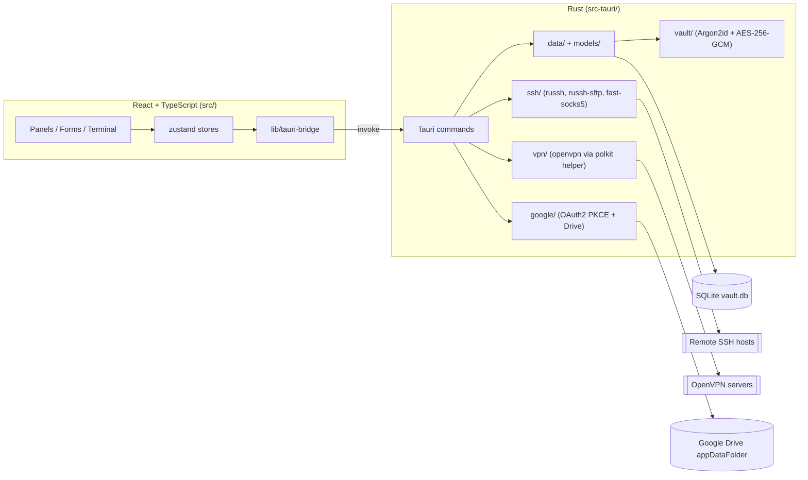

# Architecture

ConnectHub is a [Tauri 2](https://tauri.app) desktop app: a Rust backend (`src-tauri/`) exposes `#[tauri::command]` functions over Tauri's IPC bridge; a React frontend (`src/`) calls them exclusively through a typed bridge layer (`src/lib/tauri-bridge/`), never `invoke()` directly from components.

## Backend layering (`src-tauri/src/`)

- **`commands/*_commands.rs`** — thin `#[tauri::command]` wrappers. They lock `state.db`/`state.vault_key` and delegate to `data/`; no business logic lives here. New commands must be registered in **two** places in `lib.rs`: the `use commands::...` import list and the `tauri::generate_handler![...]` macro call.
- **`data/*.rs`** — CRUD and domain logic against SQLite (`rusqlite`), one module per entity (`hosts`, `groups`, `identities`, `ssh_keys`, `snippets`, `vpn_profiles`, `host_csv`). Each has its own `#[cfg(test)] mod tests` using an in-memory `Connection`.
- **`models/*.rs`** — plain `Host`/`Identity`/`SshKey`/etc. structs plus their `*Input` create/update counterparts (serde `Deserialize`, snake_case fields — Tauri does **not** camelCase these).
- **`ssh/*.rs`** — the actual SSH functionality via `russh`/`russh-sftp`/`fast-socks5`:
  - `session.rs` — interactive PTY sessions plus the shared `connect_and_authenticate` helper reused by SFTP/tunnels/exec
  - `sftp.rs` — SFTP file browser backend
  - `tunnel.rs` — local/remote/dynamic (SOCKS5) port forwarding
  - `exec.rs` — one-off command execution, used by snippets' run-on-hosts
  - `known_hosts.rs` — trust-on-first-use (TOFU) host-key pinning
- **`vault/`** — `kdf.rs` (Argon2id), `crypto.rs` (AES-256-GCM field-level encrypt/decrypt), `store.rs` (vault create/unlock/auto-unlock, the per-install local secret, and a one-time legacy-password migration path).
- **`google/`** — `oauth.rs` (PKCE authorization-code flow via a loopback listener, token exchange/refresh, cancellable mid-flow), `drive.rs` (`appDataFolder` upload/download/find via Drive API v3), `mod.rs` (ties both into `login`/`backup_now`/`restore_from_drive`).
- **`vpn/`** — `setup.rs` (installs narrowly-scoped polkit rules + helper scripts so `openvpn` and route changes can run as root without a per-connect password prompt), `mod.rs` (spawns/tracks live `openvpn` processes per profile, controlled over openvpn's local TCP management interface rather than OS signals).
- **`state.rs`** — `AppState`: holds the `Mutex<Connection>`, the in-memory `Mutex<Option<VaultKey>>`, and `DashMap`s of live SSH/SFTP/tunnel sessions keyed by UUID.
- **`error.rs`** — a single `AppError` enum (`thiserror`) shared by every command; serializes to a plain string for the frontend.

## Data model

`Group` (nested via `parent_id`) → `Host` (references `Identity`, optional `jump_host_id` pointing at another `Host` for ProxyJump chaining, optional `vpn_profile_id` pointing at a `VpnProfile`) → `Identity` (username + auth method, references `SshKey`) → `SshKey`. Plus standalone `Snippet` and `VpnProfile`, and a single-row `google_auth` table.

Only secrets are encrypted at the field level (identity passwords, private keys, key passphrases) via AES-256-GCM; everything else (labels, hostnames, ports, notes) is plaintext in SQLite for fast querying. CSV export/import (`host_csv.rs`) deliberately excludes all secret material, matching identities on the importing side by username/label rather than re-creating credentials.

## Vault / "master password"

There is **no user-facing master password**. On launch, the app auto-unlocks using a random secret generated once per installation and stored locally with `0600` permissions, never committed to source or synced anywhere. If a vault was created before this scheme existed, auto-unlock transparently falls back to a legacy path and re-encrypts every secret under the new per-install key.

This trades at-rest secrecy for convenience on a personal/single-user machine: anyone with access to your OS user account can decrypt the vault. It is **not** a substitute for OS-level disk encryption or account security if that's part of your threat model.

The SQLite database lives under your OS data directory, at a path independent of the app's display name — renaming the product in the future does not move or affect this path, so existing installs and backups keep working.

## VPN profiles

`Host.vpn_profile_id` is a nullable foreign key to `vpn_profiles` — many hosts can share one profile (e.g. one office VPN unlocking a whole private subnet).

Connecting requires root (a new `tun` interface + routes), which the app never has directly, so `vpn::connect` shells out via `pkexec` to a helper script installed once by a one-time, explicit setup step. The helper re-validates its own arguments at runtime and unconditionally forces `--script-security 0`, so an uploaded `.ovpn`'s `up`/`down`/`route-up` directives can never execute code as root regardless of what's in the file — that flag, not the polkit rule itself, is the actual security boundary.

Once running, the app controls the (root-owned) `openvpn` process over its local TCP **management interface** rather than OS signals, since an unprivileged process can't `kill()` a root-owned one: connecting opens a `127.0.0.1` socket, sends `state on` for async state notifications, and disconnecting sends `signal SIGTERM` over that same socket.

**Running multiple VPN profiles at once.** The moment a profile's tunnel reports connected, the backend looks up every host referencing that profile, resolves each hostname to an IPv4 address, finds which `tun*` interface was just assigned, and adds an explicit `/32` route for each resolved host through that interface. A `/32` route always outranks a broader one (like a `0.0.0.0/0` pushed via `redirect-gateway`) in the kernel's routing decision, so each host stays reachable through its own VPN regardless of what either server pushes for routing, and regardless of which profile (if either) currently holds the machine's default route. This is what actually makes several unrelated VPN profiles usable at the same time — a separate "don't take over my default route" checkbox exists per-profile, but it only affects that profile's *other*, unrelated traffic, not whether an assigned host is reachable.

Lifecycle is hands-off by design: a VPN comes up automatically the moment you connect/open SFTP/open a tunnel to a host that has one assigned, and goes back down automatically once nothing (no open session, no active tunnel) still needs it — even across several hosts sharing one profile. A "Disconnect all" action and an app-exit safety net exist for anything left connected unexpectedly.

VPN profile support requires the `openvpn` package and is Linux-only for now (see [Known Issues](README.md#known-issues)).

## Google Drive backup

Settings → Backup lets a user sign in with their own Google account (OAuth2 PKCE, loopback redirect) and back up/restore the **entire vault file** plus the per-install local secret to a hidden Drive `appDataFolder` — invisible in the user's normal Drive UI and readable only by this app. The refresh token is stored *inside* the encrypted vault so it survives a restore.

The shipped OAuth client ID/secret belong to this project's own registered "Desktop app" OAuth client. Google does not treat a Desktop app's `client_secret` as confidential (see [their docs](https://developers.google.com/identity/protocols/oauth2#installed)) — the real security boundary is PKCE: a fresh, random `code_verifier` is generated on every sign-in and never leaves the machine except as a one-way hash. Every user still signs in with their *own* Google account and only ever touches their *own* Drive `appDataFolder`.

If you fork this project and want your own separate OAuth identity (your own API quota, your own name on the consent screen), create your own OAuth "Desktop app" client in [Google Cloud Console](https://console.cloud.google.com) and swap `CLIENT_ID`/`CLIENT_SECRET` in `src-tauri/src/google/oauth.rs`.

Sign-in is cancellable: closing the browser tab mid-flow and clicking **Cancel** in the app unblocks immediately rather than waiting out a timeout.

## Frontend (`src/`)

- **`lib/tauri-bridge/`** — one file per domain, each wrapping `invoke("command_name", { args })`; `types.ts` holds the shared TS interfaces mirroring the Rust models.
- **`state/*Store.ts`** — [zustand](https://github.com/pmndrs/zustand) stores. Mutations generally `await` the backend call then re-fetch the full collection rather than patching state in place, since collections are small and this sidesteps subtle bugs from cascading deletes.
- **`pages/AppShell.tsx`** — the main layout: owns which manage-tab or session tab is active, and which create/edit modal is open, as local state; every panel/form is a controlled child.
- **`components/panels/HostContextPanel.tsx`** — persistent side panel for the selected/active host: Connect/SFTP/Tunnel actions, details, live session status, and Quick Commands.
- **`components/terminal/TerminalView.tsx`** / **`components/sftp/SftpBrowser.tsx`** — one instance per open session tab, kept mounted (via CSS visibility, not unmounting) while switching tabs so the SSH connection and terminal scrollback survive.
- Native file dialogs use `@tauri-apps/plugin-dialog`; reading/writing the chosen path goes through dedicated local-filesystem Tauri commands rather than a generic `fs` plugin.

## Testing

- Fast unit tests (`cargo test --lib`) run against an in-memory SQLite connection — no network required.
- Live integration tests (`cargo test --lib -- --ignored`, modules named `*::live_sshd_tests`) connect to a real local `sshd` using a dedicated throwaway SSH keypair, and are excluded from normal CI runs.
- Frontend correctness is covered by `tsc --noEmit`; there is no separate frontend test suite yet (see [ROADMAP.md](ROADMAP.md)).
