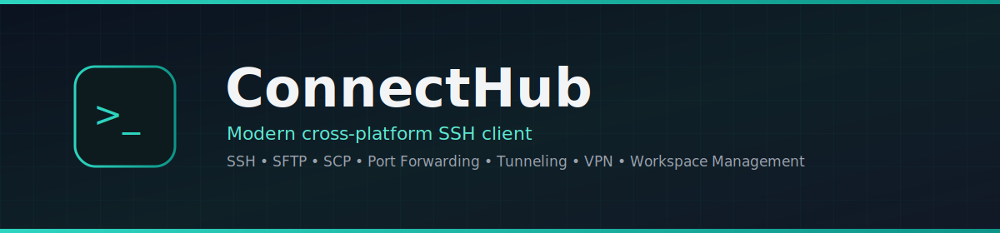
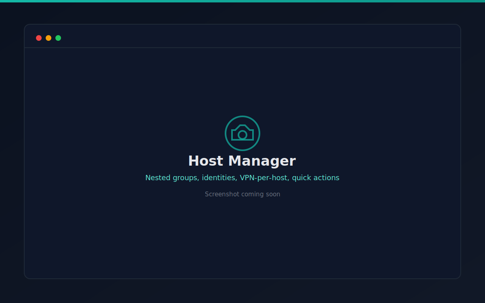
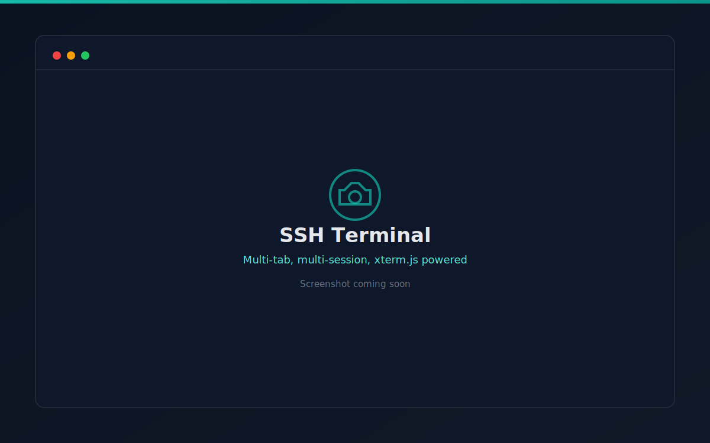
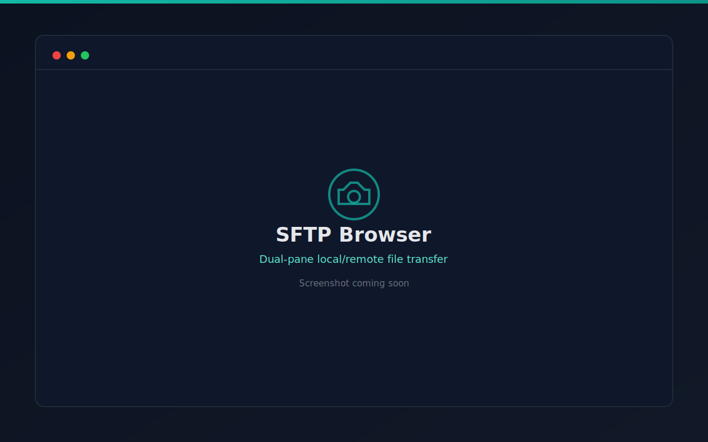
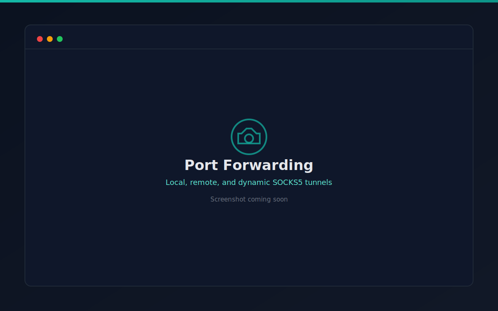
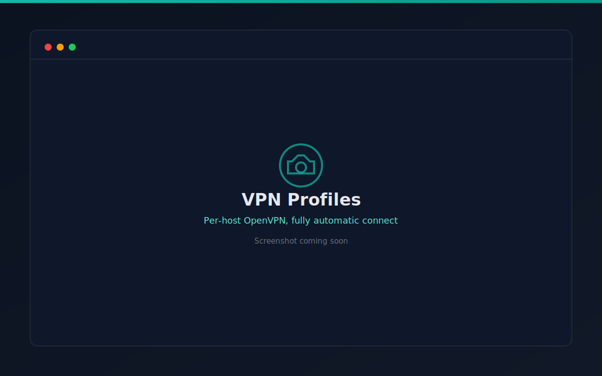
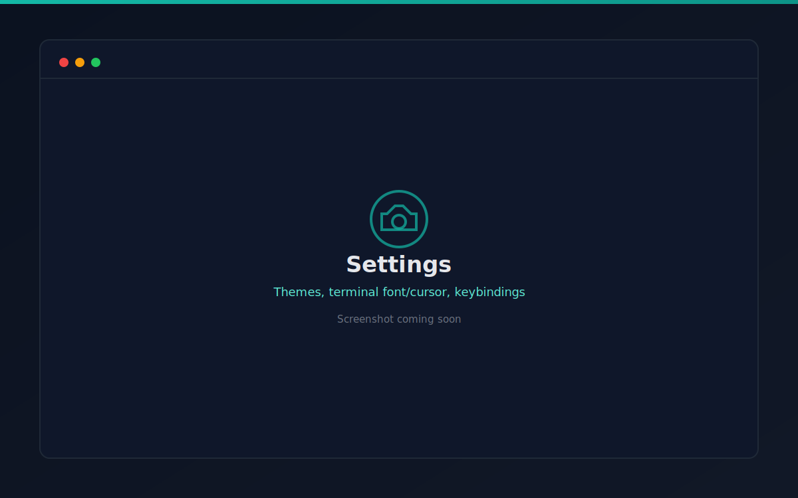
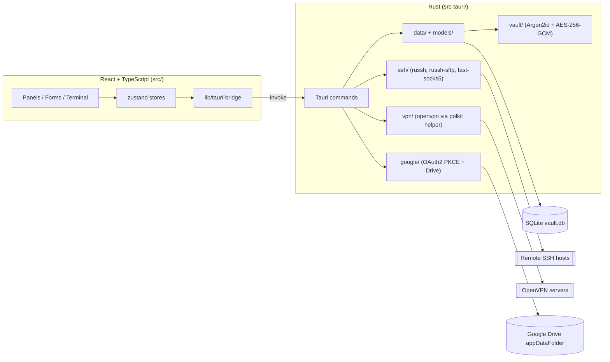

<p align="center">
  
</p>

<h1 align="center">ConnectHub</h1>

<p align="center">
  <strong>Modern cross-platform SSH client with SSH, SFTP, SCP, port forwarding, tunneling, VPN, and workspace management.</strong>
</p>

<p align="center">
  <a href="https://github.com/connecthub-client/ConnectHub/releases/latest"></a>
  <a href="https://github.com/connecthub-client/ConnectHub/actions/workflows/ci.yml"></a>
  <a href="LICENSE"></a>
  <a href="#supported-platforms"></a>
  <a href="https://github.com/connecthub-client/ConnectHub/issues"></a>
  <a href="CONTRIBUTING.md"></a>
</p>

<p align="center">
  <a href="#installation">Install</a> ·
  <a href="#features">Features</a> ·
  <a href="#screenshots">Screenshots</a> ·
  <a href="#architecture-overview">Architecture</a> ·
  <a href="#development">Development</a> ·
  <a href="#faq">FAQ</a> ·
  <a href="#contributing">Contributing</a>
</p>

---

## What is ConnectHub?

ConnectHub is a desktop SSH client for people who manage a lot of remote hosts across a lot of different networks. It bundles an SSH terminal, an SFTP file browser, port forwarding/tunneling, and per-host VPN handling into one app, backed by a local, field-level-encrypted vault — no cloud account required to use it, with optional Google Drive backup if you want one.

It's built with [Tauri 2](https://tauri.app) (Rust backend, React/TypeScript frontend), so the same codebase targets Linux, Windows, and macOS from a single native binary — no Electron, no bundled Chromium.

Inspired by tools like [Termius](https://termius.com), [Tabby](https://tabby.sh), and [Warp](https://www.warp.dev) — built independently from scratch, not affiliated with any of them.

## Features

- **Host manager** — nested groups, hosts, reusable identities (password, private key, or SSH agent auth), jump-host (ProxyJump) chaining
  - Double-click a host to connect instantly; right-click for a Connect/Duplicate/Edit/Delete menu
  - A persistent side panel shows the selected/active host's details, live session status, and one-click **Quick Commands** (run any saved snippet against it instantly)
  - Import/export your host list as CSV (host/group/identity-reference metadata only — never secrets) for backup or bulk editing
- **SSH terminal** — multi-tab, multi-session, xterm.js-powered, drag-and-drop tab reordering, TOFU host-key verification and pinning
- **SFTP browser** — dual-pane local/remote file transfer with upload/download, mkdir, rename, delete
- **Port forwarding** — local, remote, and dynamic (SOCKS5) tunnels, managed from one panel
- **VPN profiles** — every host can have its own VPN, or none. Upload an OpenVPN (`.ovpn`) profile right from a host's own edit form (or reuse one already saved, or pick "use saved key" style key selection for SSH auth) and it's fully automatic from there: click **Connect**, **SFTP**, or **Tunnel** and the assigned VPN comes up first by itself, then the host connects — no separate VPN button to manage. Multiple different profiles (one per project, say) can be connected at the same time; see [ARCHITECTURE.md](ARCHITECTURE.md#vpn-profiles) for how per-host routing makes that reliable.
- **Snippets** — save commands once, run them across one or many hosts, with per-host aggregated output
- **SSH key management** — generate new keys (Ed25519/RSA), or import existing ones (OpenSSH or legacy PEM/PKCS#1) by pasting or browsing to a file, inline while creating a host
- **Google Drive backup** *(optional)* — sign in with your own Google account to back up the full encrypted vault to your Drive's private app folder, and restore it on a new device or after a reinstall — cancellable mid-flow, never required to use the app
- **Encrypted vault** — Argon2id + AES-256-GCM field-level encryption; only secrets (passwords, private keys, passphrases) are encrypted, everything else stays plaintext for fast querying; no master password to remember
- **Settings** — light/dark/system theme (dark by default), terminal font/size/cursor/color theme with live updates to open sessions, keybindings

## Screenshots

> Screenshots below are placeholders pending final UI polish — see [docs/screenshots](docs/screenshots) for the labeled slots this table fills in. Follow the repo for the real ones as they land.

| Host manager | SSH terminal |
| --- | --- |
|  |  |

| SFTP browser | Port forwarding |
| --- | --- |
|  |  |

| VPN profiles | Settings |
| --- | --- |
|  |  |

## Supported platforms

| Platform | Architecture | Package formats | Status |
| --- | --- | --- | --- |
| Linux | x86_64 | `.AppImage`, `.deb`, `.rpm` | ✅ Primary development platform |
| Windows | x86_64 | `.msi` / NSIS installer | ⚠️ Builds via Tauri; community testing welcome |
| macOS | Intel & Apple Silicon | `.dmg` | ⚠️ Builds via Tauri; not yet code-signed/notarized |

See [Known Issues](#known-issues) below for the current caveats on Windows/macOS.

## Installation

The simplest way to install ConnectHub is to grab the build for your OS from [**GitHub Releases**](https://github.com/connecthub-client/ConnectHub/releases/latest). Exact asset filenames are shown on each release page and follow the pattern below (version number will vary).

### Linux

One command — downloads and launches the AppImage, no install step, no root required:

```bash
curl -fsSL -o ConnectHub.AppImage https://github.com/connecthub-client/ConnectHub/releases/latest/download/ConnectHub_1.0.0_amd64.AppImage \
  && chmod +x ConnectHub.AppImage \
  && ./ConnectHub.AppImage
```

Prefer a `.deb` (Debian/Ubuntu) that integrates with your app menu instead:

```bash
curl -fsSL -o connecthub.deb https://github.com/connecthub-client/ConnectHub/releases/latest/download/ConnectHub_1.0.0_amd64.deb \
  && sudo apt install ./connecthub.deb
```

Fedora/RHEL-based distros can use the `.rpm` asset the same way with `dnf install ./ConnectHub-1.0.0-1.x86_64.rpm`.

### Windows

Download the installer from the [latest release](https://github.com/connecthub-client/ConnectHub/releases/latest) (`ConnectHub_1.0.0_x64-setup.exe` or `.msi`) and run it. Since builds aren't code-signed yet, Windows SmartScreen may warn on first run — click **More info → Run anyway**.

### macOS

Download `ConnectHub_1.0.0_x64.dmg` (Intel) or `ConnectHub_1.0.0_aarch64.dmg` (Apple Silicon) from the [latest release](https://github.com/connecthub-client/ConnectHub/releases/latest), open it, and drag ConnectHub into Applications. The app isn't notarized yet, so Gatekeeper will block the first launch — right-click the app → **Open**, or run:

```bash
xattr -cr /Applications/ConnectHub.app
```

### Build from source

See [BUILD.md](BUILD.md) for a from-source build on any platform.

## Architecture overview

ConnectHub is a Tauri 2 desktop app: a Rust backend exposes typed commands over Tauri's IPC bridge; the React frontend never calls `invoke()` directly, only through a typed bridge layer. Full details, module-by-module, live in [ARCHITECTURE.md](ARCHITECTURE.md).



## Development

### Prerequisites

- Node.js 18+ and npm
- Rust toolchain (via [rustup](https://rustup.rs))
- Tauri's platform dependencies — see the [Tauri prerequisites guide](https://v2.tauri.app/start/prerequisites/) for your OS

### Setup

```bash
git clone https://github.com/connecthub-client/ConnectHub.git
cd ConnectHub
npm install
npm run tauri dev     # launches Vite + the Tauri window; Rust changes trigger an automatic rebuild+restart
```

See [DEVELOPMENT.md](DEVELOPMENT.md) for the full contributor workflow, project layout, and coding conventions.

## Build

```bash
npm run build          # frontend only: tsc && vite build
npm run tauri build    # full production bundle for your current OS
```

Full cross-platform build notes (Linux/Windows/macOS-specific steps, code signing status, bundle targets) are in [BUILD.md](BUILD.md).

## Testing

```bash
cd src-tauri
cargo test --lib                        # unit tests (fast, in-memory SQLite, no network)
cargo test --lib -- --ignored           # live integration tests against a real local sshd
cargo clippy --lib --no-default-features
```

```bash
npx tsc --noEmit       # frontend type-check
```

## Keyboard shortcuts

| Shortcut | Action |
| --- | --- |
| `Ctrl/Cmd + W` | Close the active session tab |
| `Ctrl/Cmd + Tab` | Switch to the next session tab |
| `Ctrl/Cmd + Shift + Tab` | Switch to the previous session tab |
| Double-click a host | Connect instantly |
| Right-click a host | Connect / Duplicate / Edit / Delete menu |
| Drag a session tab | Reorder open tabs |

## Security

- Field-level encryption (Argon2id + AES-256-GCM) for secrets only; everything else stays plaintext for fast querying.
- Trust-on-first-use (TOFU) host-key pinning — a later fingerprint mismatch is rejected, not silently accepted.
- No master password: the vault auto-unlocks using a random per-installation secret. This trades at-rest secrecy for convenience on a personal machine — it is **not** a substitute for OS-level disk encryption if that matters for your threat model.
- CSV export/import never includes passwords or private keys.
- VPN helper scripts run with the minimum privilege needed (see [ARCHITECTURE.md](ARCHITECTURE.md#vpn-profiles)) and force `--script-security 0` so an uploaded `.ovpn` can never execute code as root.

Full details in [ARCHITECTURE.md](ARCHITECTURE.md). To report a vulnerability, see [SECURITY.md](SECURITY.md) — please do not open a public issue.

## Roadmap

See [ROADMAP.md](ROADMAP.md) for what's planned after v1.0.0 (code signing/notarization, Windows/macOS hardening, terminal search/clipboard addons, and more).

## FAQ

**Is ConnectHub affiliated with Termius, Tabby, or Warp?**
No. It's an independent, from-scratch project inspired by them.

**Do I need a master password?**
No. The vault unlocks automatically per-installation. See [Security](#security) for the tradeoff this makes.

**Where is my data stored?**
Locally, in a SQLite database under your OS data directory. See [ARCHITECTURE.md](ARCHITECTURE.md) for the exact path and why it doesn't move if you rename/rebrand a fork.

**Is Google sign-in required?**
No — it's entirely optional and only used for backing up/restoring your vault to your own Google Drive.

**Can I use my own Google OAuth client if I fork this?**
Yes — see the [Google backup section of ARCHITECTURE.md](ARCHITECTURE.md#google-drive-backup) for how and why.

**Can I connect to hosts behind different, unrelated VPNs at the same time?**
Yes — that's what per-host VPN profiles and automatic route injection are for. See [Features](#features) and [ARCHITECTURE.md](ARCHITECTURE.md#vpn-profiles).

**Does it support SSH agent authentication?**
Yes, alongside password and private-key auth.

## Known Issues

- Windows and macOS builds are produced by Tauri's bundler but have not been through the same level of manual testing as Linux in this repo's history — please file an issue if you hit a platform-specific bug.
- macOS builds are not yet code-signed or notarized; Gatekeeper will block the first launch (see [Installation](#macos)).
- Windows builds are not yet code-signed; SmartScreen will warn on first run (see [Installation](#windows)).
- VPN profile support (`openvpn` + polkit helper) is Linux-only for now.

## Contributing

Contributions are welcome! Please read [CONTRIBUTING.md](CONTRIBUTING.md) for the dev workflow, coding conventions, and PR process, and [CODE_OF_CONDUCT.md](CODE_OF_CONDUCT.md) for community expectations.

## Support

Need help or have a question? See [SUPPORT.md](SUPPORT.md).

## Security Policy

See [SECURITY.md](SECURITY.md) for how to responsibly report a vulnerability.

## License

ConnectHub is licensed under the [MIT License](LICENSE).

## Acknowledgements

ConnectHub is built on the shoulders of great open-source projects, including [Tauri](https://tauri.app), [russh](https://github.com/Eugeny/russh), [russh-sftp](https://github.com/Eugeny/russh-sftp), [fast-socks5](https://github.com/dizda/fast-socks5), [xterm.js](https://xtermjs.org), [rusqlite](https://github.com/rusqlite/rusqlite), [React](https://react.dev), and [zustand](https://github.com/pmndrs/zustand) — and by the tools it draws inspiration from: [Termius](https://termius.com), [Tabby](https://tabby.sh), and [Warp](https://www.warp.dev).
