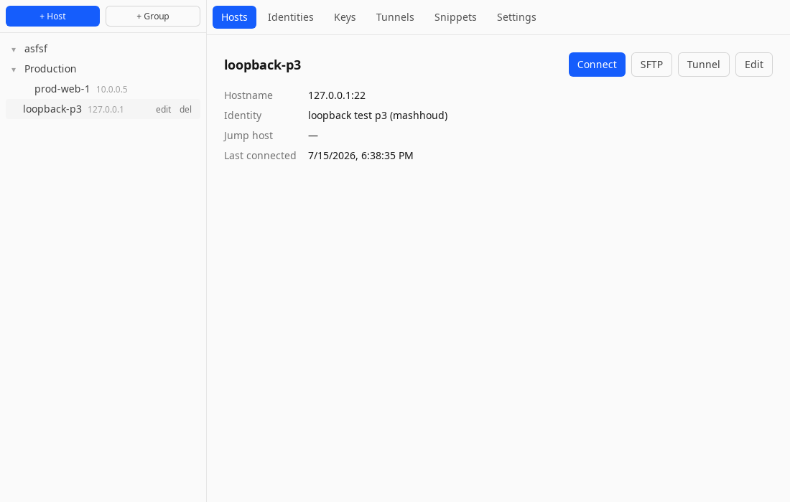
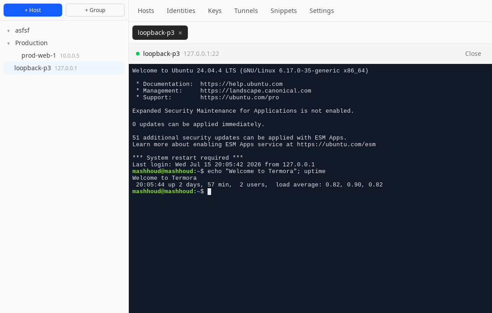
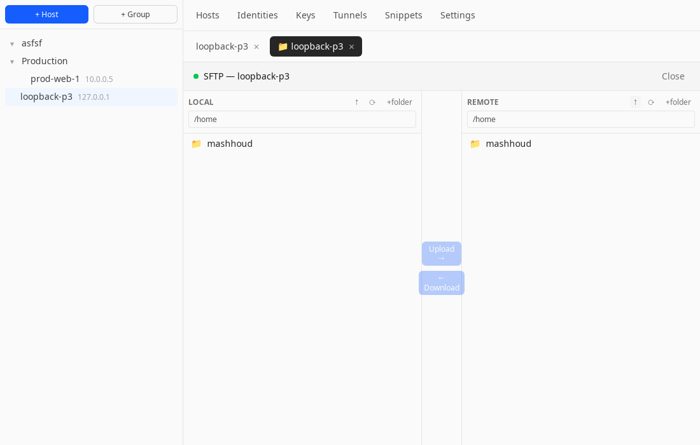
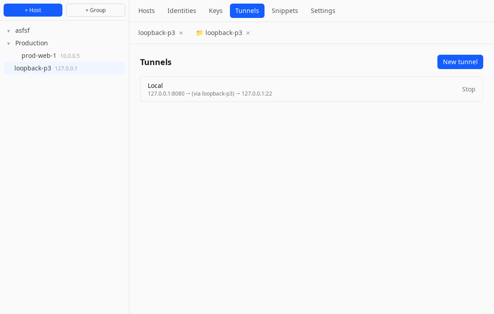
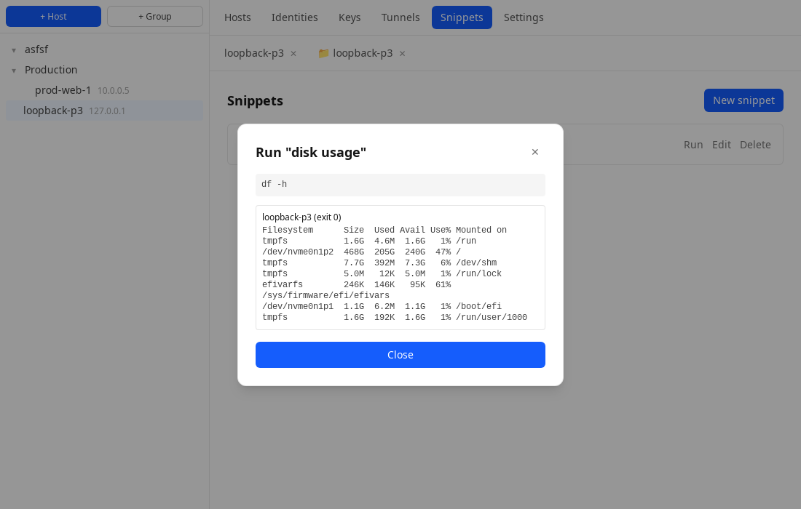
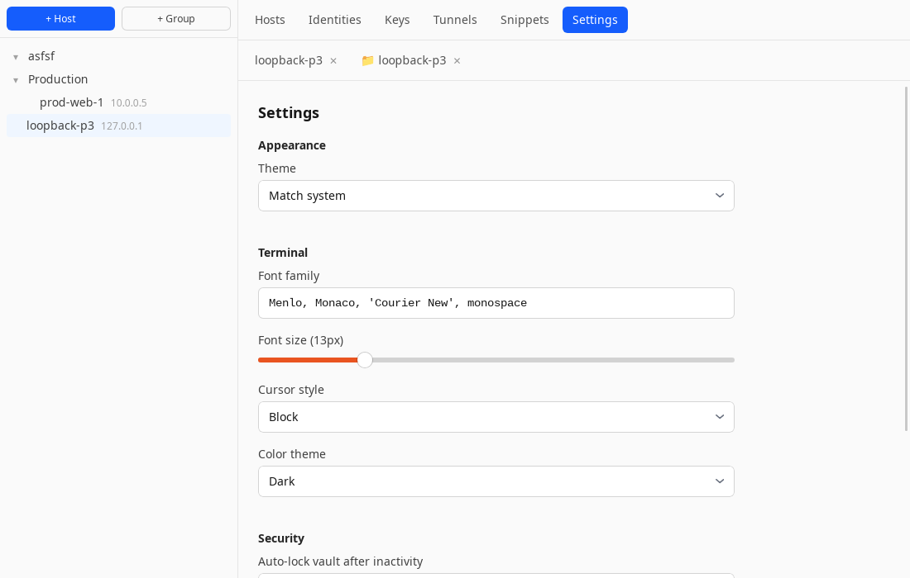
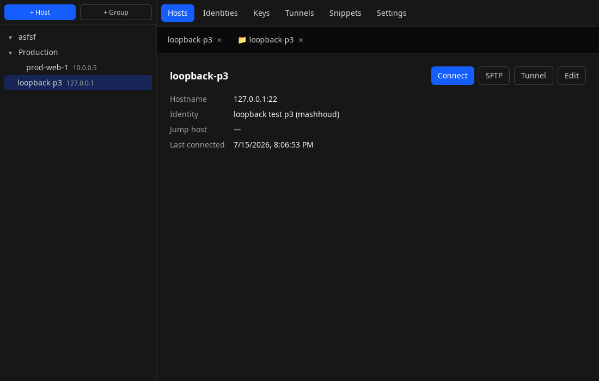

# Termora

A desktop SSH client built with Tauri, React, and Rust — host manager, terminal, SFTP, port forwarding, and snippets, backed by an encrypted local vault. Inspired by tools like Termius, built from scratch.

## Screenshots

| Host manager | Terminal |
| --- | --- |
|  |  |

| SFTP browser | Port forwarding |
| --- | --- |
|  |  |

| Snippets | Settings |
| --- | --- |
|  |  |

| Dark mode |
| --- |
|  |

## Features

- **Host manager** — nested groups, hosts, reusable identities (password/key/agent auth), jump-host (ProxyJump) chaining
- **SSH terminal** — multi-tab, multi-session, xterm.js-powered, TOFU host-key verification and pinning
- **SFTP browser** — dual-pane local/remote file transfer with upload/download, mkdir, rename, delete
- **Port forwarding** — local, remote, and dynamic (SOCKS5) tunnels, managed from one panel
- **Snippets** — save commands once, run them across one or many hosts, with per-host aggregated output
- **Settings** — light/dark/system theme, terminal font/size/cursor/color theme (with live updates to open sessions), vault auto-lock timeout, keybindings
- **Encrypted vault** — Argon2id + AES-256-GCM field-level encryption; only secrets (passwords, private keys, passphrases) are encrypted, everything else stays plaintext for fast querying; derived key held in memory only

## Tech stack

- **Backend:** Rust, Tauri 2, [`russh`](https://github.com/Eugeny/russh) (pure-Rust async SSH), `russh-sftp`, `fast-socks5`, `rusqlite`
- **Frontend:** React + TypeScript + Vite + Tailwind CSS v4, xterm.js, zustand

## Getting started

### Prerequisites

- Node.js 18+ and npm
- Rust toolchain (via [rustup](https://rustup.rs))
- Tauri's platform dependencies — see the [Tauri prerequisites guide](https://v2.tauri.app/start/prerequisites/) for your OS

### Development

```bash
npm install
npm run tauri dev
```

### Build

```bash
npm run tauri build
```

## Testing

The Rust backend has both fast unit tests and live integration tests that exercise real SSH/SFTP/tunnel flows against a local `sshd`:

```bash
cd src-tauri
cargo test --lib                       # unit tests
cargo test --lib -- --ignored          # live tests (requires a reachable local sshd)
```

## Security notes

- The vault never stores plaintext secrets on disk — only Argon2id-derived-key-encrypted ciphertext for passwords, private keys, and passphrases.
- Host key verification follows trust-on-first-use (TOFU): the first connection to a host pins its fingerprint, and any later mismatch is rejected rather than silently accepted.
- The derived vault key lives in memory only for the session and is cleared on lock/auto-lock.
